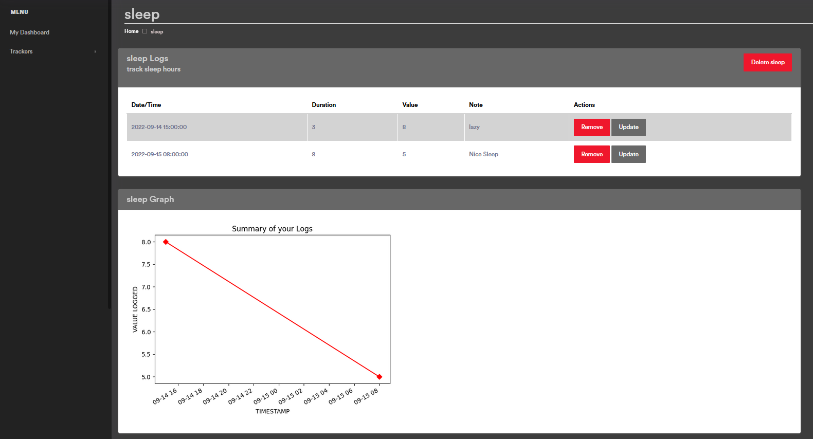
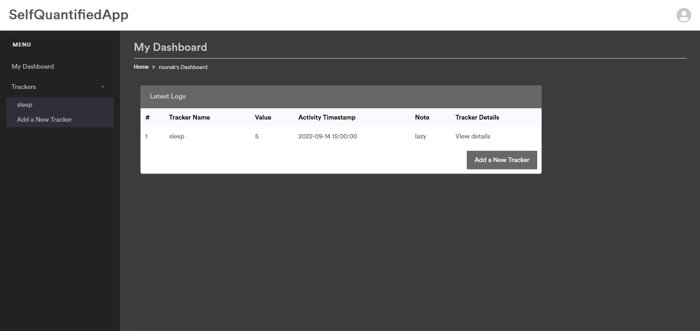
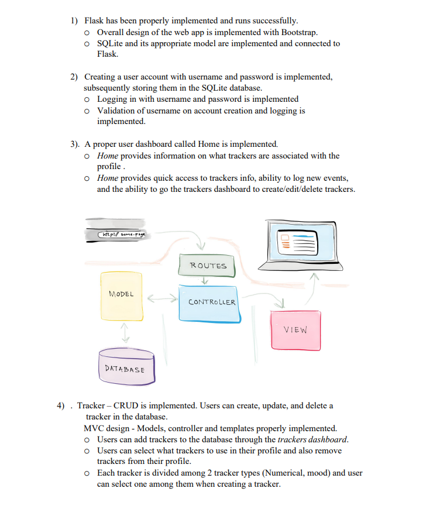
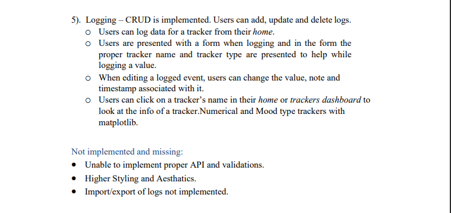

### Self Quantified App to help keep users tracks of their daily activity.
Using Flask and SQlite 

### Demo: <a href='https://self-quantify-app.herokuapp.com'>self-quantify-app</a>  !!Currently app is not working on heroku, as its free services are expired on 28th Nov

# Reqirements-
1)flask  
2)flask_sqlalchemy  
3)matplotlib   
  
# To run setup: 
  pip install flask  
  pip install sql_alchemy  
  pip install matplotlib  
  python app.py   
  
## Dashboard

## Tracker

## Stucture/Features

